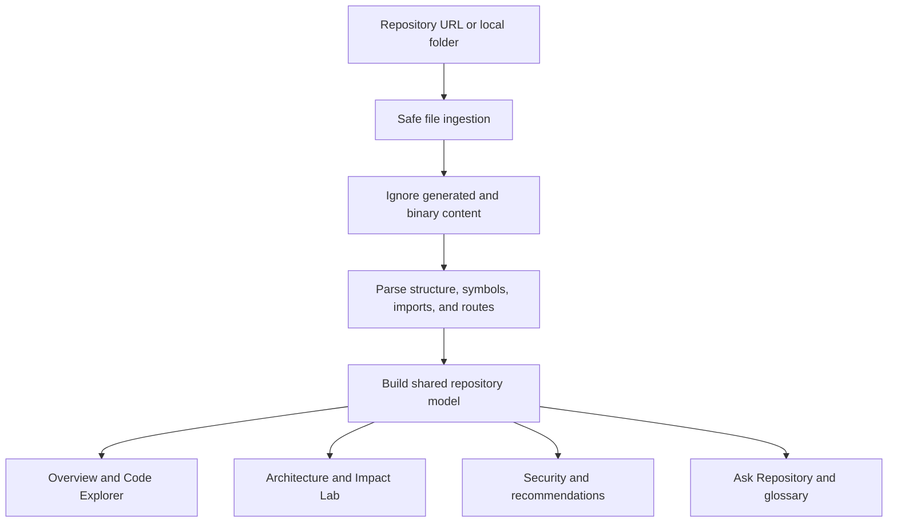

# RepoCompass

Evidence-first codebase intelligence for understanding unfamiliar repositories.

[Live demo](https://repo-compass.razikuljoni.chatgpt.site) · [Product plan](./PRODUCT_PLAN.md) · [Report an issue](https://github.com/razikuljoni/RepoCompass/issues)

RepoCompass turns a Git repository or local project folder into a navigable engineering workspace. It indexes the selected codebase and derives repository-specific architecture, file hierarchy, symbols, dependencies, routes, risks, security signals, glossary terms, branch information, and contributor guidance.

The core rule is simple: explanations must point back to real repository evidence. Facts are cited with files and line numbers, inferences are labelled, and unavailable analysis is shown honestly instead of being replaced with demo data.

## Features

- Import public GitHub repositories into durable, commit-pinned analysis jobs
- Resume queued analysis status and load integrity-checked results through capability-protected APIs
- Select or drag a local project folder for private, browser-only working-tree analysis
- Automatically exclude heavy/generated paths such as `node_modules`, `.git`, `.next`, `dist`, `build`, `coverage`, `.turbo`, `.cache`, `vendor`, `target`, and `out`
- Repository-driven overview metrics, language distribution, branches, and commits
- Expandable code explorer with folder/file icons and recursive file totals
- Path and symbol search with import, dependency, route, and source previews
- Architecture summaries derived from repository structure
- Evidence-backed deterministic repository search with explicit unavailable states
- Path-level Impact Lab with related files, tests, and workflow context
- Deterministic security signals with file and line evidence where available
- Structural risk and maintainability recommendations
- Repository-specific glossary and contributor onboarding path
- Explicit branch and architecture-drift capability boundaries
- GitHub-aligned responsive interface
- Versioned graph contracts with validated provenance, evidence, and immutable snapshot identity

## How analysis works



Every workspace reads from the same active repository model. Changing the selected project changes the entire application; screens do not fall back to unrelated sample findings.

## Technology

- React 19 and Next.js-compatible Vinext runtime
- TypeScript
- Vite
- Cloudflare Workers, Queues, D1, and private R2 artifact storage
- Tailwind CSS toolchain and custom responsive styles
- GitHub APIs and browser File System APIs for repository ingestion

## Getting started

### Requirements

- Node.js 22.13 or newer
- pnpm
- Linux for the deployment helper scripts (`flock` and GNU `timeout`)

### Install and run

```bash
pnpm install
pnpm dev
```

Open the local URL printed by Vite.

### Useful commands

```bash
pnpm dev                # Start the development server
pnpm lint               # Run ESLint with zero warnings
pnpm lint:fix           # Fix automatically resolvable lint issues
pnpm format             # Format supported files with Prettier
pnpm format:check       # Check formatting without changing files
pnpm typecheck          # Run the TypeScript compiler
pnpm check              # Run formatting, linting, and type checks
pnpm build              # Create and validate the production artifact
pnpm test:unit          # Run deterministic graph and model tests
pnpm test:artifact      # Build and test the rendered artifact
pnpm test               # Run unit and rendered-artifact tests
pnpm validate:artifact  # Validate an existing build artifact
```

### Cloudflare deployment

The durable GitHub path runs as one Cloudflare Worker backed by D1, a private R2 bucket, an analysis Queue, and a dead-letter Queue. Provision the resources referenced by `wrangler.jsonc`:

```bash
pnpm exec wrangler login
pnpm exec wrangler d1 create repo-compass-production
pnpm exec wrangler r2 bucket create repo-compass-artifacts-production
pnpm exec wrangler queues create repo-compass-analysis-production
pnpm exec wrangler queues create repo-compass-analysis-dlq-production
```

Replace the placeholder D1 ID and custom domain in `wrangler.jsonc`. Store production secrets outside source control:

```bash
pnpm exec wrangler secret put CAPABILITY_SECRET
pnpm exec wrangler secret put GITHUB_TOKEN
```

`GITHUB_TOKEN` is optional for public repositories but increases GitHub API capacity. For local development, put `CAPABILITY_SECRET` and an optional `GITHUB_TOKEN` in an ignored `.dev.vars` file. Generate binding types, migrate D1, and deploy:

```bash
pnpm cf:types
pnpm db:migrate
pnpm deploy
```

Use `pnpm db:migrate:local` for local D1 migrations. Source blobs use the `blob/` R2 prefix and must expire after seven days:

```bash
pnpm exec wrangler r2 bucket lifecycle add repo-compass-artifacts-production expire-source-blobs blob/ --expire-days 7 --force
```

Manifests and compact analysis results use separate prefixes and are not covered by that source-retention rule.

## Repository ingestion

Public GitHub URLs are resolved to a full commit and tree SHA before a job is accepted. Inventory, bounded source retrieval, and deterministic analysis run through idempotent Queue stages; metadata survives restarts in D1, while hashed manifests, source blobs, and results remain private in R2. Status and result APIs require an unguessable capability derived with `CAPABILITY_SECRET`.

Local folders stay in the browser, are never uploaded, and are labelled as ephemeral working trees rather than immutable snapshots. Private GitHub access requires a future authenticated installation flow and repository authorization checks.

The durable indexer caps inventory at 10,000 entries, analyzes at most 100 files, accepts at most 120,000 decoded bytes per file and 10,000,000 decoded bytes per snapshot, and fetches no more than 10 content files per Queue stage. It skips generated, binary, oversized, symlink, submodule, vendored, and dependency content and reports coverage explicitly.

## Reliability model

RepoCompass separates three kinds of output:

| Label       | Meaning                                                          |
| ----------- | ---------------------------------------------------------------- |
| Verified    | Directly supported by indexed code or provider data              |
| Inferred    | A reasoned explanation derived from cited evidence               |
| Unavailable | Requires evidence or analysis the current index does not contain |

Security findings should originate from deterministic rules or scanners. AI may explain a finding and suggest remediation, but it must not invent the underlying vulnerability.

## Current scope

The durable remote path currently supports public GitHub repositories only. It pins every accepted job to an immutable full commit/tree SHA, persists job and snapshot metadata in D1, stores integrity-checked artifacts privately in R2, and performs bounded analysis through idempotent Cloudflare Queue stages. Local folders remain ephemeral and browser-only. Capability tokens protect anonymous status and result access, but they are not user identity or multi-tenant authorization.

Analysis remains regex- and path-derived. The codebase includes a versioned, runtime-validated graph contract with deterministic canonicalization and a compatibility adapter, but the current indexer does not yet populate AST-resolved calls or references. Private-repository authentication, hard parser network isolation, durable graph querying, deep SAST, webhook-based incremental indexing, cancellation, and full multi-snapshot architecture drift remain future milestones.

See [PRODUCT_PLAN.md](./PRODUCT_PLAN.md) for the staged implementation roadmap.

## Roadmap highlights

- Authenticated multi-tenant repository access and retention controls
- GitHub App authorization for private repositories
- Queue cancellation, explicit retries, and incremental resumability
- Language-specific AST parsers and a durable queryable symbol graph
- Incremental re-indexing from commits and webhooks
- Deep SAST, secrets, IaC, license, and supply-chain scanning
- Pull-request blast-radius analysis and architecture drift
- MCP and editor integrations
- Evaluation suites for citation accuracy and unsupported claims

## Contributing

Issues and pull requests are welcome. For meaningful changes:

1. Create a focused branch.
2. Keep repository-derived results evidence-backed.
3. Add or update tests for analysis behavior.
4. Run `pnpm check` and `pnpm test` before opening a pull request.
5. Document any new capability boundary or provider requirement.

## Security

Do not commit provider tokens or credentials. Report sensitive vulnerabilities privately to the repository owner instead of opening a public issue.

## Author

Built by [MD Razikul Islam Joni](https://github.com/razikuljoni).

## License

No open-source license has been selected yet. All rights are reserved until a license file is added.
