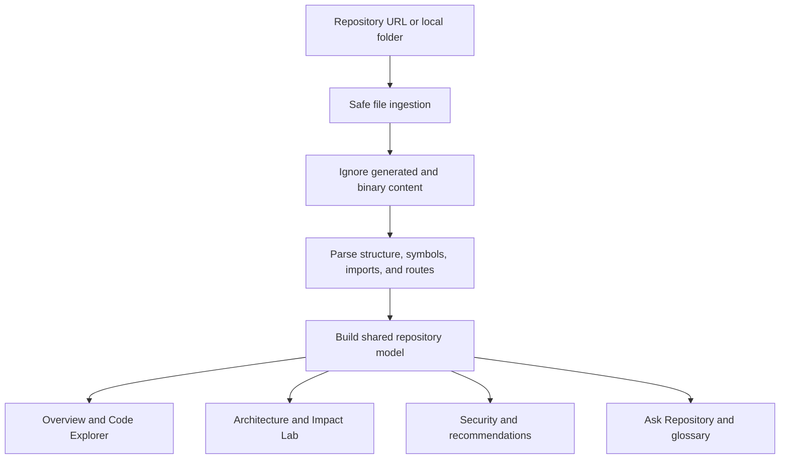

# RepoCompass

Evidence-first codebase intelligence for understanding unfamiliar repositories.

[Live demo](https://repo-compass.razikuljoni.chatgpt.site) · [Product plan](./PRODUCT_PLAN.md) · [Report an issue](https://github.com/razikuljoni/RepoCompass/issues)

RepoCompass turns a Git repository or local project folder into a navigable engineering workspace. It indexes the selected codebase and derives repository-specific architecture, file hierarchy, symbols, dependencies, routes, risks, security signals, glossary terms, branch information, and contributor guidance.

The core rule is simple: explanations must point back to real repository evidence. Facts are cited with files and line numbers, inferences are labelled, and unavailable analysis is shown honestly instead of being replaced with demo data.

## Features

- Import public GitHub, GitLab, and Bitbucket repository URLs
- Select a local folder through the operating-system file picker
- Drag and drop local project folders for browser-side indexing
- Automatically exclude heavy/generated paths such as `node_modules`, `.git`, `.next`, `dist`, `build`, `coverage`, `.turbo`, `.cache`, `vendor`, `target`, and `out`
- Repository-driven overview metrics, language distribution, branches, and commits
- Expandable code explorer with folder/file icons and recursive file totals
- Searchable symbols, imports, exports, dependencies, routes, and source previews
- Architecture graph and detail views
- Evidence-backed repository questions with verified/inferred labels
- Impact Lab with callers, dependencies, routes, tests, contracts, and ownership context
- Security findings with severity, CWE references, and exact code evidence
- Risk, coupling, supply-chain, and maintainability recommendations
- Repository-specific glossary and contributor onboarding path
- Branch comparison and architecture-drift capability boundaries
- GitHub-aligned responsive interface
- Commit-pinned investigation links and integration workspace

## How analysis works



Every workspace reads from the same active repository model. Changing the selected project changes the entire application; screens do not fall back to unrelated sample findings.

## Technology

- React 19 and Next.js-compatible Vinext runtime
- TypeScript
- Vite
- Cloudflare Workers-compatible deployment
- Tailwind CSS toolchain and custom responsive styles
- Optional Cloudflare D1 with Drizzle ORM
- Provider APIs and browser File System APIs for repository ingestion

## Getting started

### Requirements

- Node.js 22.13 or newer
- npm
- Linux for the deployment helper scripts (`flock` and GNU `timeout`)

### Install and run

```bash
npm install
npm run dev
```

Open the local URL printed by Vite.

### Useful commands

```bash
npm run dev                # Start the development server
npm run lint               # Run ESLint
npm run build              # Create and validate the production artifact
npm test                   # Build and run rendered-output tests
npm run validate:artifact  # Validate an existing build artifact
```

## Repository ingestion

Public repository URLs use provider APIs where available. Local folders are processed in the browser and are not uploaded by the current prototype. Private-provider access requires OAuth applications and secure token storage before production use.

The indexer intentionally limits oversized repositories and skips generated, binary, vendored, and dependency content. These boundaries keep the browser responsive and prevent a fashionable dashboard from turning into a space heater.

## Reliability model

RepoCompass separates three kinds of output:

| Label | Meaning |
| --- | --- |
| Verified | Directly supported by indexed code or provider data |
| Inferred | A reasoned explanation derived from cited evidence |
| Unavailable | Requires evidence or analysis the current index does not contain |

Security findings should originate from deterministic rules or scanners. AI may explain a finding and suggest remediation, but it must not invent the underlying vulnerability.

## Current scope

The deployed version performs real provider/local ingestion and content-derived analysis within safe browser limits. Production-scale exhaustive AST analysis, deep SAST, private-repository OAuth, persistent analysis history, background jobs, webhook-based incremental indexing, and full multi-snapshot architecture drift remain backend milestones.

See [PRODUCT_PLAN.md](./PRODUCT_PLAN.md) for the staged implementation roadmap.

## Roadmap highlights

- Persistent multi-tenant repository and analysis storage
- Provider OAuth for private repositories
- Queue-based workers with cancellation and resumable indexing
- Language-specific AST parsers and a durable symbol graph
- Incremental re-indexing from commits and webhooks
- Deep SAST, secrets, IaC, license, and supply-chain scanning
- Pull-request blast-radius analysis and architecture drift
- MCP and editor integrations
- Evaluation suites for citation accuracy and unsupported claims

## Contributing

Issues and pull requests are welcome. For meaningful changes:

1. Create a focused branch.
2. Keep repository-derived results evidence-backed.
3. Add or update tests for analysis behavior.
4. Run `npm run lint` and `npm test` before opening a pull request.
5. Document any new capability boundary or provider requirement.

## Security

Do not commit provider tokens or credentials. Report sensitive vulnerabilities privately to the repository owner instead of opening a public issue.

## Author

Built by [MD Razikul Islam Joni](https://github.com/razikuljoni).

## License

No open-source license has been selected yet. All rights are reserved until a license file is added.
